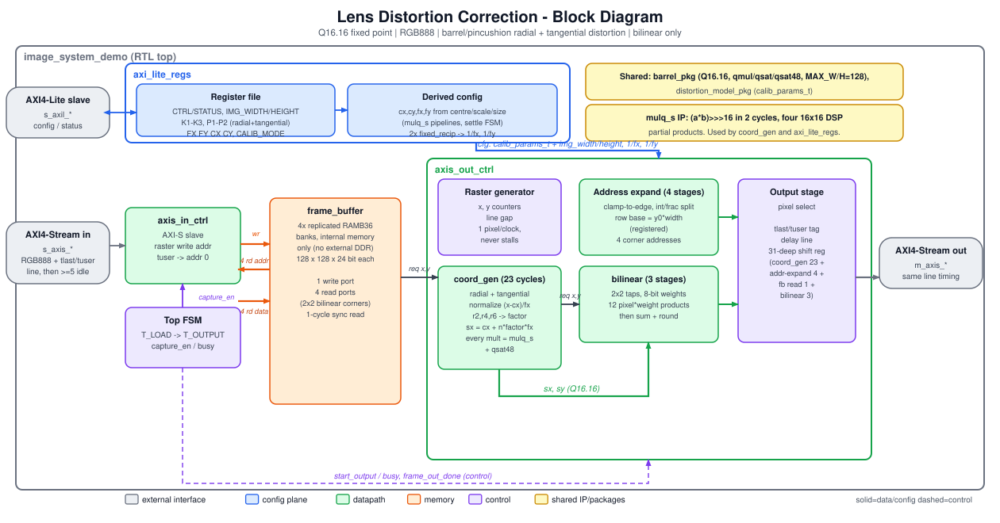

# Lens Distortion Correction

A small hardware demo that corrects barrel lens distortion on
a streaming video frame. Radial correction up through the **k3·r6** term
plus tangential ("plumb bob") distortion, AXI4-Stream video I/O, an
AXI4-Lite control interface, and bilinear interpolation. The
frame buffer is built entirely from internal (on-chip) memory; there is
no external-DDR path. The top-level RTL module remains `image_system_demo`
(`rtl/image_system_demo.sv`).

The SystemVerilog testbench has been tested using Icarus Verilog. The input
stimulus is always generated and is a synthetic test chart.

## Block diagram



*(`docs/block_diagram.svg` / `.png`; regenerate with `make diagram` after
editing `docs/make_block_diagram.py`.)*

Reading it left to right: an AXI4-Stream frame is written into the
4x-replicated `frame_buffer` by `axis_in_ctrl`; once the whole frame is
loaded the top FSM starts `axis_out_ctrl`, whose raster generator asks
`coord_gen` for the source coordinate of each output pixel (radial +
tangential distortion, fixed 23-cycle latency, 1 pixel/clock, never
stalls). The coordinate is expanded into the four frame_buffer read
addresses and bilinear-interpolated. A tag delay line re-creates
`tlast`/`tuser` for the output stream, 31 cycles behind the request that
produced them. The AXI4-Lite register file, and the derived-configuration
math it runs whenever the geometry changes, feed everything through a
single `calib_params_t` bus.

## Repository layout

```
rtl/
  barrel_pkg.sv              Q16.16 fixed-point format, shared params, qmul()/qsat()/qsat48() --
                              shared dependency of the ip/ modules below
  distortion_model_pkg.sv    calib_params_t struct (camera intrinsics + radial/tangential
                              coefficients) -- shared dependency of ip/coord_gen/
  axis_in_ctrl.sv            AXI4-Stream video slave -> frame buffer
  axis_out_ctrl.sv           raster gen + coord_gen + addressing + bilinear -> AXI4-Stream video master
  axi_lite_regs.sv           AXI4-Lite config register file
  image_system_demo.sv       top-level integration + load/output sequencing FSM

ip/
  fixed_recip/
    fixed_recip.sv            iterative 1/x divider (config-plane only) -- no package dependency
    tb_fixed_recip.sv         self-checking testbench (vs. an independent 64-bit reference divide)
    run.sh
  mulq/
    mulq_s.sv                 2-cycle pipelined 32x32 multiply with the Q16.16 shift built in
                               (the timing-closure workhorse); no package dependency
    tb_mulq.sv                self-checking testbench (20k random + corner vectors)
    run.sh
  frame_buffer/
    frame_buffer.sv           4x-replicated full-frame BRAM store, internal memory only
    tb_frame_buffer.sv        self-checking testbench (write/readback, 4-port independence,
                              read latency, concurrent write/read)
    run.sh
  coord_gen/
    coord_gen.sv               per-pixel address-generation pipeline:               camera-calibration
                              normalization + radial/tangential distortion
    tb_coord_gen.sv            self-checking testbench, inline independent golden reference
    run.sh
  bilinear/
    bilinear.sv                 2x2 bilinear interpolator
    tb_bilinear.sv              self-checking testbench (corners, center, general cases, latency)
    run.sh

Each ip/<name>/ and rtl/ also contain:
  build.f                    RTL file list for Yosys synthesis of that module
  run_yosys.sh               runs Yosys from build.f; results in ./yosys/

synth/
  yosys_common.ys            the shared Yosys script (xc7, BRAM + DSP mapping, hierarchical stat)
  run_all_yosys.sh           synthesize every module + timing table (synth/summary.md)
  est_timing.py              netlist-based timing estimator (explicit delay model)
  summarize.py               one-line resource summary from a utilization report
  view_waves.sh              open a VCD in the Surfer waveform viewer

docs/
  make_block_diagram.py      generates block_diagram.svg/.png (make diagram)

ci/
  run_checked.sh             pass/fail from output markers, not just exit codes
.github/workflows/ci.yml     GitHub Actions: sim + synthesis on every push to main
Makefile                     make test-ip | test-smoke | test-sv | sim | synth | ci

tb_verilog/
  ppm_io_pkg.sv               binary PPM (P6) WRITER, pure SystemVerilog. Write-only by
                              design: this demo never reads a user-supplied image file.
  golden_model_pkg.sv         independent fixed-point golden model (radial/tangential +
                              bilinear), least-squares correction-coefficient fitter, and
                              synthetic chart generator, pure SystemVerilog
  tb_image_system_demo.sv     self-checking testbench: generates its own test chart, warps
                              it with barrel distortion, corrects it through the DUT, checks
                              bit-exactness and image-quality improvement
  tb_smoke.sv                 fast smoke test: coord_gen calibration/tangential checks
  run.sh                      builds + runs the full regression with iverilog/vvp only
  run_smoke.sh                builds + runs just the fast smoke test
  work/                       test_{square,portrait,landscape}.ppm, warped_*.ppm, corrected_*.ppm
```

## Running it

```
make sim              # test-ip + test-smoke + test-sv (a few seconds total)
make synth             # Yosys synthesis + timing estimate, every module
make ci                # sim + synth
```

or run any piece directly:

```
cd ip/fixed_recip  && ./run.sh
cd ip/mulq         && ./run.sh
cd ip/frame_buffer && ./run.sh
cd ip/coord_gen    && ./run.sh
cd ip/bilinear     && ./run.sh
cd tb_verilog       && ./run_smoke.sh     # fast, coord_gen only
cd tb_verilog       && ./run.sh           # full regression: square/portrait/landscape
```

Add `VCD=1` to any of them to dump `waves.vcd` (and `SURFER=1` to open it
in Surfer -- see "Waveforms (Surfer)" below). There is no `FULL`/large-frame
option in this demo build: every testbench always uses the short-edge-64
frame set.

### Results

| test | checks | notes |
|---|---|---|
| `ip/fixed_recip` | 12/12 | powers of two, non-powers-of-two, smallest/largest operand, zero (saturate) |
| `ip/mulq` | 20013/20013 | 2-cycle pipelined 32x32 multiply, corner values + 20k random vectors |
| `ip/frame_buffer` | 1017/1017 | write-then-readback, 4-port independence, 1-cycle read latency, concurrent write(A)/read(B) |
| `ip/bilinear` | 12/12 | 4 corners, exact center, 3 general cases, 3-cycle pipeline latency, no bubble leak-through |
| `ip/coord_gen` | 18/18 | identity, radial (barrel), tangential, boundary coordinates |
| `tb_verilog` smoke | 18/18 | same coverage as `ip/coord_gen`, driven at the project level |
| `tb_verilog` full regression | 12/12 | barrel distortion x {square, portrait, landscape}, bit-exact vs. golden model, genuine MAE improvement |

Sample result from a full-regression run (barrel, k1=0.08 forward /
k1=-0.0759 fitted correction): `MAE(warped, original)=68.4`,
`MAE(DUT-corrected, original)=34.4` -- a real, measured image-quality
improvement, not just a bit-exactness check.

## Algorithm

For each output pixel `(x, y)`, `coord_gen` computes the fractional
source coordinate to sample:

```
nx = (x - cx_pix) / fx_pix          -- normalize (pinhole intrinsics)
ny = (y - cy_pix) / fy_pix
r2 = nx^2 + ny^2
radial   = 1 + k1*r2 + k2*r2^2 + k3*r2^3        (k3 * r^6 term)
tang_x   = 2*p1*nx*ny + p2*(r2 + 2*nx^2)
tang_y   =   p1*(r2 + 2*ny^2) + 2*p2*nx*ny
sx = cx_pix + (nx*radial + tang_x) * fx_pix
sy = cy_pix + (ny*radial + tang_y) * fy_pix
```

Barrel distortion is `k1<0` in the *correction* coefficient (this demo's
only tested case) -- the same math also corrects pincushion (`k1>0`) and
tangential-only distortion, but only barrel is exercised by this demo's
testbenches. `sx,sy` are then bilinear-interpolated from the frame buffer
(`bilinear.sv`, 2x2 taps, clamp-to-edge at the frame boundary).

## Fixed-point format

Every value in this design is Q16.16 (`barrel_pkg.sv`): a 32-bit signed
word, 16 integer bits (including sign), 16 fractional bits. The core
multiply primitive is `qmul(a,b) = (a*b) >>> 16`, arithmetic-shifted and
saturated to 32 bits. On the timing-critical datapath (`coord_gen`,
`bilinear`, the config-plane math in `axi_lite_regs`), the multiply is
split into `mulq_s` (a 2-cycle pipelined `(a*b)>>>16`, built from four
16x16 DSP48 partial products) followed by a `qsat48()` saturate stage --
bit-identical to `qmul()`, just pipelined. See "Timing closure" below for
why this exists.

## AXI4-Stream interfaces

Both `s_axis_*` (video in) and `m_axis_*` (video out) use the same
framing: each line is `IMG_WIDTH` back-to-back beats (`tvalid` held high,
`tlast` on the final pixel of the line), followed by at least
`LINE_GAP_CYCLES` (5) idle cycles before the next line. `tuser` marks the
first pixel of the frame. `PIX_W=24` (RGB888, packed `{R[7:0], G[7:0],
B[7:0]}`). Because the bilinear datapath is fully pipelined and never
stalls, the same "line, then idle" timing on the input reappears
identically on the output, 31 cycles later -- `axis_out_ctrl` doesn't
need to reconstruct this timing, it falls out for free.

## AXI4-Lite register map

Word-aligned, 32-bit registers (byte offsets):

| offset | name | description |
|---|---|---|
| 0x00 | CTRL | `[0]` soft_reset (self-clearing) |
| 0x04 | STATUS | `[0]` busy (RO) `[1]` frame_done (sticky, write-1-to-clear) `[2]` recip_busy (RO) |
| 0x08 | IMG_WIDTH | active frame width, 1..MAX_W (MAX_W=128 in this demo) |
| 0x0C | IMG_HEIGHT | active frame height, 1..MAX_H (MAX_H=128 in this demo) |
| 0x10 | K1 | signed Q16.16, radial coefficient (r^2 term) |
| 0x14 | K2 | signed Q16.16, radial coefficient (r^4 term) |
| 0x18 | K3 | signed Q16.16, radial coefficient (r^6 term) |
| 0x1C | CENTER_X | unsigned Q16.16, fraction of width (0.5 = 0x0000_8000) |
| 0x20 | CENTER_Y | unsigned Q16.16, fraction of height (0.5 = 0x0000_8000) |
| 0x24 | SCALE | unsigned Q16.16, edge-crop zoom (1.0 = 0x0001_0000) |
| 0x28 | VERSION | RO, 0x0001_0000 |
| 0x30 | CALIB_MODE | `[0]` 0=legacy center+scale (default), 1=direct FX/FY/CX/CY |
| 0x34 | FX | signed Q16.16 pixels, focal length X (CALIB_MODE=1 only) |
| 0x38 | FY | signed Q16.16 pixels, focal length Y (CALIB_MODE=1 only) |
| 0x3C | CX | signed Q16.16 pixels, principal point X (CALIB_MODE=1 only) |
| 0x40 | CY | signed Q16.16 pixels, principal point Y (CALIB_MODE=1 only) |
| 0x44 | P1 | signed Q16.16, tangential ("plumb bob") coefficient 1 |
| 0x48 | P2 | signed Q16.16, tangential coefficient 2 |

Writing `IMG_WIDTH`, `IMG_HEIGHT`, `CENTER_X`, `CENTER_Y`, `SCALE`,
`CALIB_MODE`, `FX`, `FY`, `CX` or `CY` automatically retriggers the
derived-configuration settle sequence.

**No bounds checking is performed against MAX_W/MAX_H anywhere in this
design** -- see "Known limitations" below, this is deliberate for this
demo, not an oversight.

## Pipeline / timing

Latencies are measured directly in simulation (`axis_out_ctrl.sv`'s
`TOTAL_LATENCY` constant drives the tlast/tuser tag delay line; the
regression's tlast/tuser timing checks fail if it's off by even one):

- `coord_gen`: 23-stage feed-forward pipeline (every multiply is a
  `mulq_s`, 2 cycles, plus a saturate/add stage), one new request
  accepted every clock.
- address-expand (integer/fraction split + clamp-to-edge, `y0*width`
  row-base multiply, row-base add, four corner addresses): 4 cycles.
- `frame_buffer` synchronous read: +1 cycle.
- `bilinear`: 3-stage pipeline (weights; the 12 pixel*weight products;
  sum/round/select).
- **Total pipeline latency: 31 cycles**, request to output pixel, fully
  pipelined at 1 pixel/clock, never stalls.

## Timing closure

An earlier, more general revision of this project's `coord_gen`
documentation claimed the design "easily meets 100 MHz ... single 32x32
multiply per stage". That was wrong: a one-cycle 32x32 multiply plus its
shift/saturate/add is roughly 11 ns of logic on Xilinx 7-series --
already short of a 10 ns (100 MHz) target before accounting for a real
per-pixel divide that revision also had. Measuring with
`synth/est_timing.py` (below) found the worst path in that revision was
about 48 ns.

**The fix, `ip/mulq/mulq_s.sv`.** A signed 32x32 multiply that returns
exactly `(a*b) >>> 16` (48-bit) in 2 cycles: four 16x16 partial products
(one DSP48E1 each; Yosys absorbs their register as `MREG`) combined in
the second stage using `(a*b)>>>16 = ah*bh*2^16 + (ah*bl+al*bh) +
floor(al*bl/2^16)` (exact, because the low half is unsigned).
`barrel_pkg::qsat48()` then saturates it, so `qsat48(mulq_s(a,b)) ==
qmul(a,b)` for **all** inputs -- verified on 20,013 vectors
(`ip/mulq/tb_mulq.sv`), and confirmed by every bit-exact image-level
check in this project's testbenches passing unchanged. Every
timing-critical multiply in `coord_gen.sv`, `bilinear.sv` (the 12
pixel-weight products get their own registered stage instead of sharing
one with the sum), and `axi_lite_regs.sv`'s config-plane math goes
through it. Data registers on these paths carry no reset (only the valid
bits do) -- an async reset on a datapath register prevents the
synthesizer from absorbing it into a DSP48's internal register.

Current per-module worst-path estimate at a 10 ns (100 MHz) target (see
"Synthesis with Yosys" for how these are produced and their caveats):

| module | est. worst path | slack |
|---|---|---|
| `fixed_recip` | 4.65 ns | 5.35 |
| `mulq_s` | 7.20 ns | 2.80 |
| `frame_buffer` | 0.80 ns | 9.20 |
| `bilinear` | 7.75 ns | 2.25 |
| `coord_gen` | 7.20 ns | 2.80 |
| **`image_system_demo` (top)** | **8.20 ns** | **1.80** |

The top-level critical path runs through `bilinear`'s weight-product
DSP48 input, not through `coord_gen` or the config plane -- confirming
the fix addressed the actual bottleneck, not just the module that used to
be worst.

## Synthesis with Yosys (Xilinx 7-series)

Every module directory (`ip/fixed_recip`, `ip/mulq`, `ip/frame_buffer`,
`ip/bilinear`, `ip/coord_gen`, and `rtl/` for the whole top level) has:

- `build.f` -- the RTL file list for that module, in dependency order
  (packages first), `#` comments allowed;
- `run_yosys.sh` -- reads `build.f`, runs Yosys, writes everything to that
  directory's `yosys/` subdirectory, and prints a one-line resource summary.

All of them execute the same shared script, `synth/yosys_common.ys`:
`hierarchy -check -auto-top` -> `synth_xilinx -family xc7` (proc/opt/fsm,
**memories mapped to BRAM** and **multiplies packed into DSP48E1**, both
default-on, only disabled by `-nobram`/`-nodsp`; hierarchy kept, since
flattening is opt-in) -> `stat` for the **hierarchical utilization report**
-> netlist writes. Results in each `yosys/`:

| file | contents |
|---|---|
| `yosys.log` | full Yosys log |
| `utilization_hier.rpt` | per-module cell counts plus the rolled-up "design hierarchy" total |
| `synth_netlist.v` / `.json` | hierarchical mapped netlist |
| `synth_netlist_flat.json` | flattened copy, used only for timing estimation |

```
cd ip/coord_gen && ./run_yosys.sh     # one module
make synth                            # all six + timing table -> synth/summary.md
CLOCK_NS=8 synth/run_all_yosys.sh     # tighter timing target
```

`make synth` writes `synth/summary.md` and **exits non-zero if any module
has negative estimated slack**, which is what CI gates on. Current
results (Yosys 0.33, xc7, 10 ns target):

| module | LUT | FF | DSP48E1 | RAMB36 | SRL | est. worst path | slack |
|---|---|---|---|---|---|---|---|
| `ip/fixed_recip` | 173 | 140 | 0 | 0 | 0 | 4.65 ns | 5.35 |
| `ip/mulq` | 48 | 48 | 4 | 0 | 0 | 7.20 ns | 2.80 |
| `ip/frame_buffer` | 0 | 0 | 0 | 48 | 0 | 0.80 ns | 9.20 |
| `ip/bilinear` | 0 | 27 | 16 | 0 | 0 | 7.75 ns | 2.25 |
| `ip/coord_gen` | 2162 | 1401 | 72 | 0 | 380 | 7.20 ns | 2.80 |
| **top level (`rtl/`)** | 3590 | 3205 | 114 | 48 | 396 | **8.20 ns** | 1.80 |

`frame_buffer` maps to 48 RAMB36E1 (128x128x24-bit, 4x replicated for
single-cycle 2x2 bilinear reads) -- comfortably within a mid-size 7-series
part, unlike an earlier, more general revision of this project that
supported much larger frames and needed 1,536.

### Yosys portability rules (what the RTL obeys, and why)

Open-source Yosys 0.33's Verilog frontend accepts only a *subset* of
SystemVerilog. Every rule below was found by reproducing the failure in a
minimal file, and the RTL was changed to comply (the simulator, Icarus,
accepts both forms, so none of this changes simulated behaviour):

1. **No `return` in functions** -- assign to the function name instead.
2. **No file-scope `import pkg::*;`** before a module (nor in the module
   header, in this version) -- qualify every package reference
   (`barrel_pkg::PIX_W`, `distortion_model_pkg::calib_params_t`). Local
   parameters that shadow a package name still work unqualified.
3. **Package struct types in port lists must be qualified**
   (`input distortion_model_pkg::calib_params_t cfg`).
4. **No struct-typed function arguments** ("failed to resolve identifier for
   width detection") -- pass the individual fields.
5. **No `pkg::type'(expr)` casts** -- a plain assignment converts the same bits.
6. **Signed casts / signed function results used directly as a module
   port-connection expression crash Yosys** (`Assert arg->is_signed ==
   sig.as_wire()->is_signed`): `.a($signed(x))`, `.operand($unsigned(f(x)))`.
   Declare an intermediate wire of the right signedness and connect that.
7. **No packed multi-dimensional arrays** (`logic [1:0][31:0] x`) -- use flat
   vectors or small helper modules instantiated from a `generate` loop.

A related simulator-side trap worth knowing: a Verilog **part-select is
always unsigned** (`r[31:0] * w` is an unsigned multiply); wrap it in
`$signed()` where signed arithmetic is intended.

## Waveforms (Surfer)

Every testbench can dump a VCD, and `synth/view_waves.sh` opens it in the
[Surfer](https://surfer-project.org) waveform viewer:

```
cd ip/bilinear && VCD=1 ./run.sh                  # writes ip/bilinear/waves.vcd
cd ip/bilinear && VCD=1 SURFER=1 ./run.sh         # ... and opens it in Surfer
synth/view_waves.sh ip/bilinear/waves.vcd         # open an existing file
VCD=1 tb_verilog/run.sh                            # -> tb_verilog/work/waves.vcd
```

The testbenches use a guarded `` `ifdef DUMP_VCD `` block, so normal runs
pay nothing. The whole-design regression records only the first
`VCD_WINDOW_NS` (default 300,000 ns; override with `-DVCD_WINDOW_NS=`)
because a full multi-frame run would produce an unmanageably large file.
If `surfer` is not on `PATH` the script prints install options (release
binary, `cargo install`, or the in-browser viewer) and the VCD path -- any
VCD viewer works with the files.

## Continuous integration (GitHub Actions)

The repository-root workflow at `.github/workflows/ci.yml` runs on pushes,
pull requests, and manual dispatch as three parallel jobs, each just a
`make` target:

| job | command | what it checks |
|---|---|---|
| Simulation - IP + smoke | `make test-ip test-smoke` | five standalone IP testbenches + coord_gen smoke test |
| Simulation - SystemVerilog | `make test-sv` | barrel-distortion regression, bit-exact vs. golden model |
| Synthesis | `make synth` | Yosys for all six modules; **fails on estimated timing violation** |

- Tests fail on a bad *result*, not just a bad exit code: `vvp` exits 0
  even when a testbench prints FAIL, so `ci/run_checked.sh` requires the
  PASS marker and rejects FAIL markers. This was verified by injecting a
  functional bug, a compile error, and a timing violation -- each made
  the gate fail.
- This demo's tests always use the short-edge-64 frame set -- there is no
  large-frame CI option (unlike an earlier, more general revision of this
  project).
- Logs (`ci/logs/`), generated images, synthesis reports
  (`yosys/`, `synth/summary.md`) are uploaded as artifacts; the synthesis
  table is also shown in the job summary.
- Runner: `ubuntu-latest` by default (Ubuntu 24.04: `apt` provides
  Icarus 12.0 and Yosys 0.33, the exact versions this project was
  developed with). To use a **self-hosted runner**, set the repository
  variable `CI_RUNNER_LABELS` to a JSON array of labels, e.g.
  `["self-hosted","linux"]`; the tool-install steps are skipped when the
  tools already exist. Pull requests are enabled in the repository-root
  workflow.
- The whole flow was verified locally from a *fresh clone* of a scratch
  git repository (commit, clone, run the same `make` targets), which
  catches missing/untracked files. The workflow YAML was parsed and
  structure-checked, but **it has not been executed on GitHub** -- this
  environment cannot reach GitHub Actions.

## Known limitations / what this demo intentionally does not do

This is a scoped-down **demo** build. An earlier, more general revision
of this project additionally supported fisheye, panoramic, and
perspective (homography) correction; bicubic interpolation; frame sizes
up to 720 pixels on a side; a Python/cocotb testbench; and reading a
user-supplied image file. All of that was removed for this demo, along
with every line of RTL, golden-model code, and register bits that only
existed to support it -- this README describes what remains, not what
was cut.

- **No bounds checking against MAX_W/MAX_H, anywhere, by design.**
  `IMG_WIDTH`/`IMG_HEIGHT` (AXI-Lite 0x08/0x0C) are taken exactly as
  written; nothing in `axi_lite_regs.sv`, `axis_in_ctrl.sv`,
  `axis_out_ctrl.sv`, or `frame_buffer.sv` checks them against the
  128x128 capacity `barrel_pkg.sv`'s `MAX_W`/`MAX_H` actually provides.
  **Programming a size larger than that is a silent configuration
  error**: addresses wrap or alias inside the frame buffer, and the
  design produces wrong output with no error flag, no status bit, and no
  message anywhere -- this demo's testbench never exercises that case,
  and there is nothing to catch it if you do.
- **Frame buffer is on-chip only, 4x replicated** (`frame_buffer.sv`) to
  get single-cycle 4-corner bilinear reads, sized to `MAX_W x MAX_H`
  (`barrel_pkg.sv`, 128x128 for this demo). This does not scale to large
  frames -- there is no external-memory path in this demo at all (an
  earlier revision of this project noted a windowed-DDR-cache extension
  for larger resolutions; that extension does not exist here either, by
  design, since this demo only targets 128x128).
- **Single-buffered sequencing**: a new input frame is only accepted
  after the previous frame's output has finished streaming
  (the top-level `T_LOAD`/`T_OUTPUT` FSM). Overlapped
  (ping-pong) buffering for back-to-back full-frame-rate operation is not
  implemented.
- **No mid-pipeline backpressure**: `m_axis_tready` is assumed high
  throughout.
- Out-of-frame samples use clamp-to-edge (repeats the border pixel)
  rather than producing black.
- **Bilinear only** -- no bicubic, no selectable interpolation mode (the
  `INTERP_MODE` register from an earlier revision was removed).
- **Radial + tangential distortion only** -- no fisheye, panoramic, or
  perspective/homography correction (the `MODEL_SEL` register and the
  `H11`-`H32` homography registers from an earlier revision were removed).
- **No image file reading** -- `ppm_io_pkg.sv` only writes PPM files; this
  demo's testbench always generates its own synthetic test chart
  (`golden_model_pkg.sv`'s `generate_synthetic_chart`), never loads one
  from disk.
- **Timing is estimated, not signed off.** "MET at 10 ns" comes from
  `synth/est_timing.py` (an explicit per-cell delay model on the Yosys
  netlist, no placement or routing), not Vivado/nextpnr STA. Re-check
  with a vendor tool before relying on 100 MHz.
- **The GitHub Actions workflow is unexecuted on GitHub** (see
  "Continuous integration"); its commands were verified locally from a
  fresh clone.
